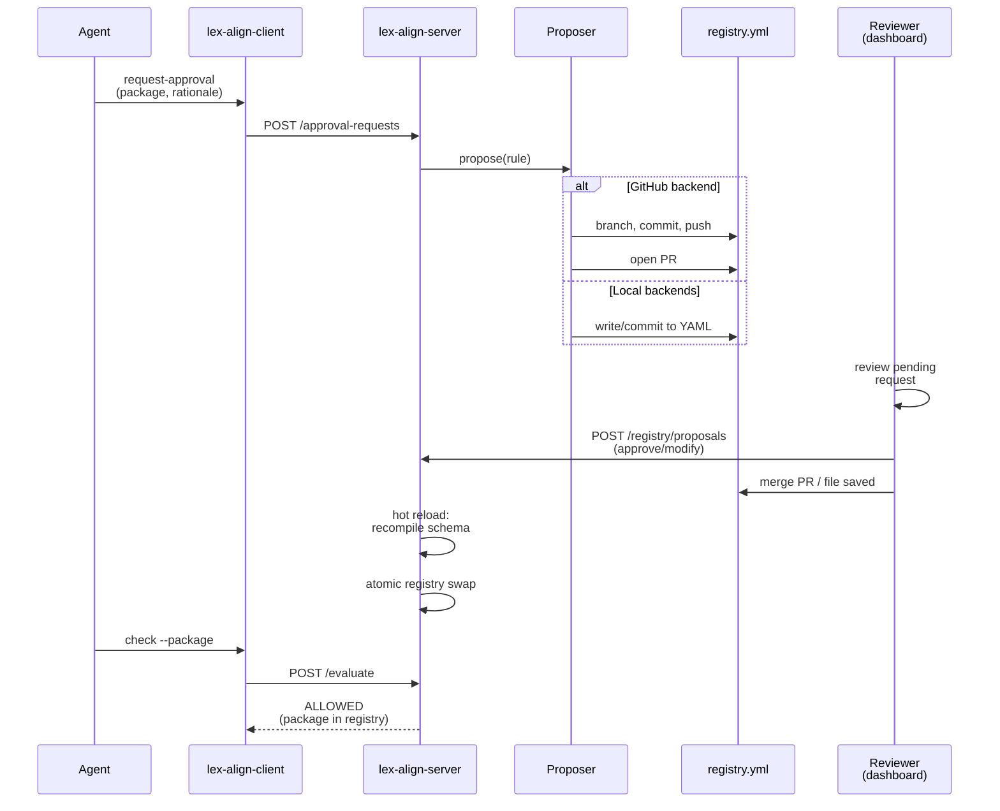

<p align="center">
  
</p>

<h1 align="center">lex-align</h1>

<p align="center">
  <a href="https://dlfelps.github.io/lex-align/">Docs</a> ·
  <a href="https://dlfelps.github.io/lex-align/getting-started/">Getting started</a> ·
  <a href="https://dlfelps.github.io/lex-align/agent-support/">Agent support</a> ·
  <a href="https://dlfelps.github.io/lex-align/for-agents/">For agents</a>
</p>

`lex-align` enforces your dependency policy before AI agents or developers can
commit it. Every package gets checked against your approved registry, OSV CVE
scores, and license rules — returning one of three deterministic verdicts so
agents can act without ambiguity. Full docs at
[dlfelps.github.io/lex-align](https://dlfelps.github.io/lex-align/).

---

## Why

Your AI coding agent adds packages to `pyproject.toml` faster than anyone can
review them. By the time legal notices the AGPL dep, or security spots the
critical CVE, it's already in `main`. You need the check to happen *before*
the bytes are written, not after the PR is open.

---

## How it works

A FastAPI server is the source of truth. The client is thin: a CLI plus hooks.

- **Three gates per check:** internal registry → OSV CVE → PyPI license.
- **Three-verdict vocabulary:** `ALLOWED`, `PROVISIONALLY_ALLOWED`, `DENIED` —
  small, deterministic, easy for an agent to branch on.
- **Two enforcement points:** a git `pre-commit` hook (universal backstop,
  fires for every agent and every human committing to a governed repo) and a
  Claude Code `PreToolUse` hook that intercepts `pyproject.toml` edits before
  the file is written.
- **Use first, approve in parallel:** an unknown package that passes CVE and
  license checks comes back `PROVISIONALLY_ALLOWED`. The agent uses it, calls
  `request-approval`, and keeps moving — formal review runs async.

Python and `pyproject.toml` only. Self-hosted via Docker Compose. Single-user
mode is the default.

---

## Quickstart

**Single-user / evaluation (no Docker):**

```bash
pip install lex-align
lex-align-server quickstart        # ~/.lexalign + in-process server on :8765

# in another terminal, per-project
cd /path/to/your/project
lex-align-client init --yes
lex-align-client audit             # vet existing pyproject.toml deps
lex-align-client status            # one-screen overview
```

In single-user mode the `PreToolUse` hook auto-enqueues approval requests
when it sees `PROVISIONALLY_ALLOWED`, so the user-as-reviewer flow stays
a single tool call. See the
[Single-user Quickstart](https://dlfelps.github.io/lex-align/single-user-quickstart/).

**Team deployment (Docker Compose):**

```bash
# Server (host you control)
pip install lex-align
lex-align-server init && cd lexalign
lex-align-server registry compile registry.yml registry.json
docker compose up -d

# Client (per-project)
pip install lex-align
cd /path/to/your/project
lex-align-client init
lex-align-client check --package httpx
```

For server tuning, registry authoring, hook layout, and Claude Code wiring,
see the
[full Getting Started guide](https://dlfelps.github.io/lex-align/getting-started/).

---

## Agent support

Primary target is **Claude Code** — pre-commit hook, `PreToolUse` edit-time
intercept, and an auto-written `CLAUDE.md` so every session knows how to use
`check` and `request-approval`. Cursor, Aider, and anything else committing to
a governed repo are backstopped by the pre-commit hook. Full matrix:
[agent support](https://dlfelps.github.io/lex-align/agent-support/).

---

## Project status

| Phase | Status |
|---|---|
| **1.** Server core (registry, license, CVE, audit, evaluate) | ✅ shipped |
| **2.** Thin client (init, check, request-approval, pre-commit, Claude hooks) | ✅ shipped |
| **3.** Approval workflow UI + reporting endpoints + agent identity | ✅ shipped |
| **4.** Pluggable org-mode auth | ✅ shipped |
| **5.** Pluggable approval proposers (local-file, local-git, GitHub PR) + hot-reload | ✅ shipped |
| **6.** Single-user workflow (`quickstart`, `audit`, `status`, auto-enqueue) | ✅ shipped |

Every registry change now flows through a *proposer*: opens a PR
(GitHub), commits to a local repo (local-git), writes the YAML
directly (local-file), or just logs (log-only / evaluation). The
server hot-reloads on merge or YAML write — no restarts. See
[Approvals & Reloads](https://dlfelps.github.io/lex-align/git-backed-approvals/)
for the full flow, GitHub permission requirements, and the
"why-is-this-pending" panel on the dashboard.

The dashboard's classify endpoint that mutated the in-memory registry
in Phase 3 is gone — every change now has a single source of truth in
`registry.yml`, with a reload trigger pulling the new state into
memory.



---

## Contributing

```bash
uv sync --all-groups
uv run pytest
```

Tests live under `tests/client/` and `tests/server/`. PRs welcome — file
issues for bugs, license-policy edge cases, or agent-integration gaps.

---

## License

See [LICENSE](./LICENSE).
