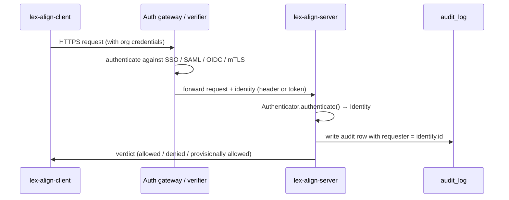

# Org Mode: Authentication

Single-user mode (`AUTH_ENABLED=false`) is what you use for local
evaluation: bind to `127.0.0.1`, no auth, every request shows up in
the audit log as `anonymous`. Org mode (`AUTH_ENABLED=true`) is what
you use when the server is reachable to a team and you need a real
audit trail with named requesters.

The server doesn't ship its own SSO — it plugs into whatever you
already run. There are three built-in backends and an escape hatch
for the rare org that needs custom Python.

| Backend | When to use it | Org-side work |
| --- | --- | --- |
| **`header`** *(recommended)* | You have any auth gateway in front (oauth2-proxy, Pomerium, Authelia, Cloudflare Access, ingress-nginx with `auth_request`, Envoy ext_authz, an internal SSO proxy, …) | Configure the gateway to forward `X-Forwarded-User` |
| **`webhook`** | You don't have a gateway but do have an internal user-info or session-validation service | Implement one HTTP endpoint that validates a token and returns user JSON |
| **`module:path:Class`** | Truly custom needs (HSM-backed tokens, mTLS-cert-to-identity, token introspection with custom claim mapping, …) | Write one Python file implementing `Authenticator` |
| `apikey` | *Reserved.* Returns HTTP 501 — placeholder for a future built-in API-key store. | — |

The dependency surface (`get_identity` / `get_requester`) is the same
across backends — your endpoints don't change when you swap one in.

## How identity flows through the server



The Authenticator returns an `Identity`:

```python
@dataclass(frozen=True)
class Identity:
    id: str                       # → audit_log.requester
    email: str | None = None      # → dashboards
    groups: tuple[str, ...] = ()  # → future per-team authorization
    raw: Mapping[str, Any] = {}   # backend-specific extras
```

## 1. The `header` backend (recommended)

Your existing auth gateway authenticates the user against your IdP
and forwards the result as headers. lex-align trusts those headers
**only when the request reaches the server through a proxy IP listed
in `AUTH_TRUSTED_PROXIES`** — direct callers are rejected with HTTP
401 even if they spoof the headers.

### Configure the server

```ini
# .env
AUTH_ENABLED=true
AUTH_BACKEND=header

# Headers your gateway injects (defaults shown)
AUTH_USER_HEADER=X-Forwarded-User
AUTH_EMAIL_HEADER=X-Forwarded-Email
AUTH_GROUPS_HEADER=X-Forwarded-Groups
AUTH_GROUPS_SEPARATOR=,

# CIDRs your gateway sits in. Direct callers from outside these
# blocks get HTTP 401 even if they set the headers.
AUTH_TRUSTED_PROXIES=10.0.1.0/24,fd00::/8
```

### Configure your gateway

=== "oauth2-proxy"

    ```yaml
    # oauth2-proxy.cfg
    set_xauthrequest = true
    pass_user_headers = true
    pass_authorization_header = true
    upstreams = ["http://lex-align:8765"]
    ```
    `oauth2-proxy` writes `X-Forwarded-User` / `X-Forwarded-Email` /
    `X-Forwarded-Groups` automatically when `set_xauthrequest = true`.

=== "Pomerium"

    Pomerium injects `X-Pomerium-Claim-Email` and friends. Either
    rename them with a `set_request_headers` rule or point lex-align
    at them directly:
    ```ini
    AUTH_USER_HEADER=X-Pomerium-Claim-Email
    AUTH_GROUPS_HEADER=X-Pomerium-Claim-Groups
    ```

=== "ingress-nginx"

    ```yaml
    nginx.ingress.kubernetes.io/auth-url:
      "https://auth.example.com/oauth2/auth"
    nginx.ingress.kubernetes.io/auth-response-headers:
      "X-Auth-Request-User,X-Auth-Request-Email,X-Auth-Request-Groups"
    nginx.ingress.kubernetes.io/auth-snippet: |
      proxy_set_header X-Forwarded-User $auth_user;
    ```

=== "Cloudflare Access"

    Cloudflare Access sends `Cf-Access-Authenticated-User-Email` and
    a signed `Cf-Access-Jwt-Assertion`. Either rename via a
    Cloudflare Worker / Transform Rule, or point lex-align at the
    Cloudflare-native header:
    ```ini
    AUTH_USER_HEADER=Cf-Access-Authenticated-User-Email
    ```

## 2. The `webhook` backend

If you don't have a gateway, run a small endpoint that validates the
client's bearer token and returns user JSON. lex-align forwards every
request's `Authorization: Bearer <token>` to your endpoint.

### Configure the server

```ini
# .env
AUTH_ENABLED=true
AUTH_BACKEND=webhook
AUTH_VERIFY_URL=https://identity.internal.example.com/verify
AUTH_VERIFY_TIMEOUT=3.0
```

### Implement the verifier

The verifier accepts `POST <AUTH_VERIFY_URL>`:

```http
POST /verify HTTP/1.1
Content-Type: application/json

{"token": "<bearer token from the client>"}
```

On success, return HTTP 200 with:

```json
{
  "id": "alice@example.com",
  "email": "alice@example.com",
  "groups": ["engineering", "security"]
}
```

Only `id` is required. Return HTTP 401 / 403 to reject. Any other
4xx/5xx is treated as "auth service error" and surfaces as HTTP 401
to the client.

A FastAPI verifier is ~15 lines:

```python
from fastapi import FastAPI, HTTPException
from pydantic import BaseModel

app = FastAPI()

class VerifyBody(BaseModel):
    token: str

@app.post("/verify")
def verify(body: VerifyBody):
    user = my_session_store.lookup(body.token)
    if user is None:
        raise HTTPException(401, "Invalid token")
    return {"id": user.email, "email": user.email, "groups": user.groups}
```

## 3. Custom Python — `module:path:Class`

For the rare case where neither header nor webhook fits — mTLS cert
introspection, JWT verification against a JWKS endpoint with custom
claim mapping, HSM-backed token check, etc. — drop a file into the
container and point `AUTH_BACKEND` at it.

```python
# /opt/myorg/auth.py
from lex_align_server.authn import Authenticator, AuthError, Identity
from fastapi import Request

class MyAuthenticator(Authenticator):
    def __init__(self, *, settings, http_client):
        # Stash dependencies you need; both kwargs are always passed.
        self.jwks = MyJwksClient(settings.my_jwks_url)

    async def authenticate(self, request: Request) -> Identity:
        token = (request.headers.get("authorization") or "")[7:]
        if not token:
            raise AuthError("Bearer token required.")
        claims = self.jwks.verify(token)
        return Identity(
            id=claims["sub"],
            email=claims.get("email"),
            groups=tuple(claims.get("roles", [])),
            raw={"source": "myorg-jwt", "claims": claims},
        )
```

```ini
# .env
AUTH_ENABLED=true
AUTH_BACKEND=myorg.auth:MyAuthenticator
PYTHONPATH=/opt/myorg
```

The class is instantiated **once** at server startup with
`settings=Settings(...)` and `http_client=httpx.AsyncClient(...)` as
keyword arguments. Either accept whichever you need or use `**kwargs`.
Anything that isn't an `Authenticator` subclass raises `TypeError`
at boot — misconfiguration fails fast, not at request time.

## Reference

### All settings

| Env var | Backend | Default | Purpose |
| --- | --- | --- | --- |
| `AUTH_ENABLED` | all | `false` | Master switch — `false` always uses anonymous |
| `AUTH_BACKEND` | all | `header` | `header` / `webhook` / `apikey` / `anonymous` / `module:Class` |
| `AUTH_USER_HEADER` | header | `X-Forwarded-User` | Required identity header |
| `AUTH_EMAIL_HEADER` | header | `X-Forwarded-Email` | Optional |
| `AUTH_GROUPS_HEADER` | header | `X-Forwarded-Groups` | Optional |
| `AUTH_GROUPS_SEPARATOR` | header | `,` | How `groups` is delimited in the header |
| `AUTH_TRUSTED_PROXIES` | header | `127.0.0.1/32,::1/128` | Comma-separated CIDRs the gateway runs in |
| `AUTH_VERIFY_URL` | webhook | *unset* | Verifier endpoint |
| `AUTH_VERIFY_TIMEOUT` | webhook | `3.0` | Per-request timeout (seconds) |

### Operational notes

- **Failure mode is closed**: a missing header, an unreachable
  webhook, or a custom backend that raises returns HTTP 401 to the
  client. The server never silently drops to anonymous when org mode
  is on.
- **`AUTH_ENABLED=false` is always the rip-cord**: during incident
  response, flipping the master switch off restores anonymous-only
  access without removing your backend configuration.
- **Audit rows record `identity.id` verbatim**, so what you put in
  `id` is what shows up in the dashboards' "Requester" column.
  Prefer stable principals (email, sub claim) over anything that
  rotates.
- **Trust the proxy CIDR carefully**: the `header` backend's whole
  threat model is "an attacker who can reach the server directly
  shouldn't be able to claim arbitrary identities." Set
  `AUTH_TRUSTED_PROXIES` to the smallest range that includes your
  gateway. `0.0.0.0/0` means "trust everyone" — only use that in
  test environments.
