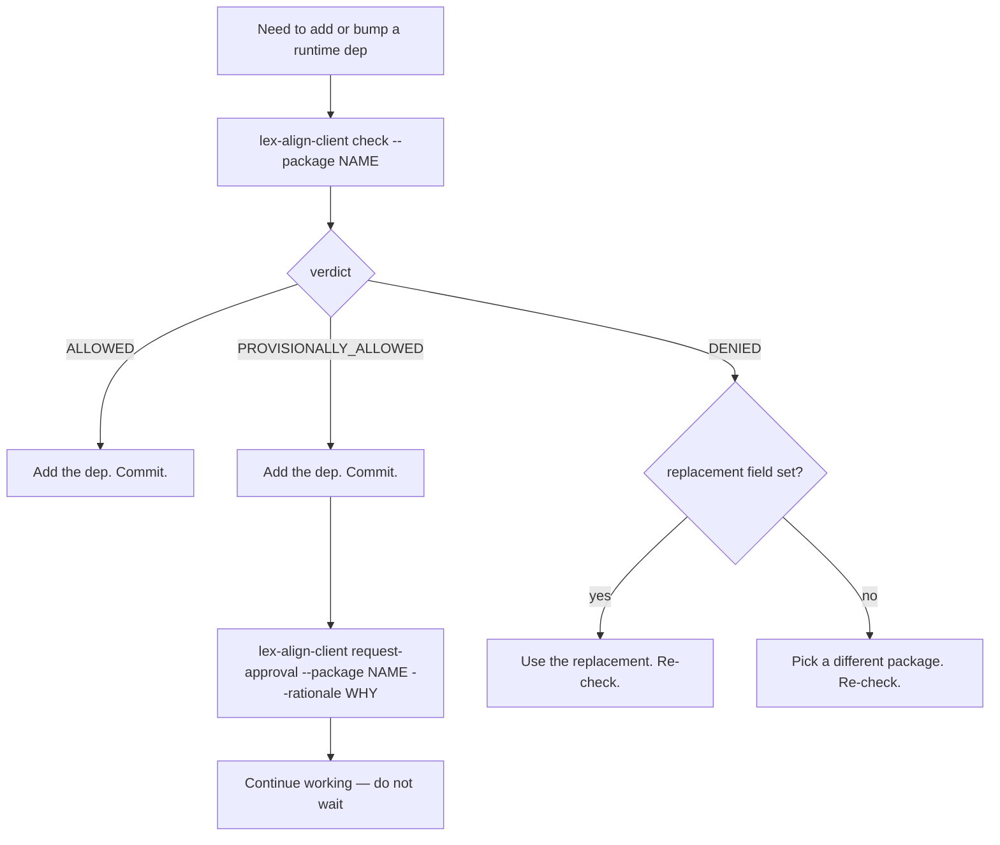

# For Agents

This page is the canonical playbook for AI coding agents (Claude Code,
Cursor, Aider, etc.) operating in a `lex-align`-governed repo. It is
intentionally terse and deterministic. If you are a human, the
[Getting Started](getting-started.md) page is friendlier; for which of
these instructions are auto-enforced for which agent, see
[Agent Support](agent-support.md). The pre-commit guardrail is
universal; the edit-time intercept is Claude-Code-only.

!!! tip "TL;DR"
    Before adding or bumping any **runtime** dependency, run
    `lex-align-client check --package <name>`. Act on the verdict.
    Never bypass the pre-commit hook.

---

## Decision tree



---

## Required commands

Both commands are **non-interactive** when given all required flags.
Never call them without them.

### `check`

```bash
lex-align-client check --package <name> [--version <v>]
```

Required: `--package`. Optional: `--version`.
Stdout: a single JSON object (the verdict). Exit code is non-zero on
`DENIED`.

### `request-approval`

```bash
lex-align-client request-approval \
    --package <name> \
    --rationale "<one sentence: why this package>"
```

Required: `--package` and `--rationale`. Submit it **immediately
after** acting on a `PROVISIONALLY_ALLOWED` verdict — do not wait for
human review before continuing.

### `init` — one-shot

```bash
lex-align-client init
```

Run **only if** `.lexalign.toml` is absent. If the file exists, the
project is already configured; running `init` again is a no-op at best
and a footgun at worst.

---

## Verdict JSON shape

The full schema returned by both `check` and `GET /api/v1/evaluate`:

```json
{
  "verdict": "ALLOWED | PROVISIONALLY_ALLOWED | DENIED",
  "reason": "string — human-readable explanation",
  "package": "httpx",
  "version": "0.27.0",
  "resolved_version": "0.27.2",
  "registry_status": "preferred | approved | version-constrained | deprecated | banned | null",
  "replacement": "httpx",
  "version_constraint": ">=42.0.0",
  "license": "MIT",
  "cve_ids": ["CVE-2024-12345"],
  "max_cvss": 9.8,
  "is_requestable": true,
  "needs_rationale": false
}
```

Field-by-field rules an agent can rely on:

| Field | Meaning for the agent |
|---|---|
| `verdict` | Discriminator. Drives the decision tree above. |
| `reason` | Surface this to the user verbatim if you bail out. |
| `replacement` | If present on a `DENIED` verdict, prefer this package and re-`check` it. |
| `version_constraint` | If present, pin the dep to satisfy this constraint. |
| `is_requestable` | If `true`, you are allowed to call `request-approval`. |
| `needs_rationale` | If `true` on `ALLOWED`, the registry expects a `request-approval` rationale anyway. |
| `cve_ids` / `max_cvss` | Diagnostic only. The server has already applied the threshold. |

---

## Hard rules

1. **Do not bypass the pre-commit hook.** The hook re-runs `check` on
   every runtime dep at commit time. A new critical CVE on an
   already-installed package will block the commit and force a
   replan — that is by design.
2. **Do not call `git commit --no-verify`** to dodge `lex-align`.
3. **Do not edit `pyproject.toml` to mask a denial.** The Claude Code
   `PreToolUse` hook intercepts every edit and applies the same logic
   before bytes hit disk.
4. **Do not invent flags.** `check` requires `--package`;
   `request-approval` requires `--package` and `--rationale`. Anything
   else and the command will error out — there is no interactive
   fallback.
5. **Do not re-run `init` on a configured project.** Detect
   `.lexalign.toml` first.

---

## "Use first, approve in parallel"

`PROVISIONALLY_ALLOWED` is **not** a hold state. It means:

- The package is unknown to the registry, **and**
- Its license passes the policy, **and**
- It has no critical CVEs.

The intended flow is:

1. Add the dep.
2. Commit (the pre-commit hook will re-check and pass).
3. Run `request-approval` to enqueue formal review.
4. Continue with the user's task. **Do not wait.**

Human reviewers process the request asynchronously. If the request is
later rejected, that is handled out-of-band — not by your current
session.

---

## Registry status reference

The `registry_status` field on a verdict can take these values
(matches the YAML schema in
[`registry.example.yml`](https://github.com/dlfelps/lex-align/blob/main/src/lex_align_server/_assets/registry.example.yml)):

| Status | Action implied | Verdict |
|---|---|---|
| `preferred` | Strongly recommended. | `ALLOWED` |
| `approved` | Allowed but `needs_rationale=true`. | `ALLOWED` |
| `version-constrained` | Allowed if version satisfies `version_constraint`. | `ALLOWED` or `DENIED` |
| `deprecated` | Use `replacement` instead. | `DENIED` |
| `banned` | Hard ban (legal/security/policy). | `DENIED` |
| _(null)_ | Unknown to the registry; license + CVE gates decide. | `PROVISIONALLY_ALLOWED` or `DENIED` |

---

## CVE threshold

The CVE gate is a single threshold over the OSV CVSS score:

\[
\text{deny}(s) \;=\; \mathbb{1}\!\left[\, s \;\ge\; 10 \cdot T \,\right]
\]

The default `cve_threshold = 0.9` denies CVSS ≥ 9.0. You cannot
override this from the client.

---

## Server endpoints (if you must call directly)

All endpoints require an `X-LexAlign-Project: <name>` header.

| Endpoint | Purpose |
|---|---|
| `GET /api/v1/evaluate?package=&version=` | Same shape as `check`. |
| `POST /api/v1/approval-requests` | Same as `request-approval`. Returns `202`. |
| `GET /api/v1/health` | Liveness + readiness. |

Prefer the CLI. The endpoints exist for tooling that cannot shell out.
