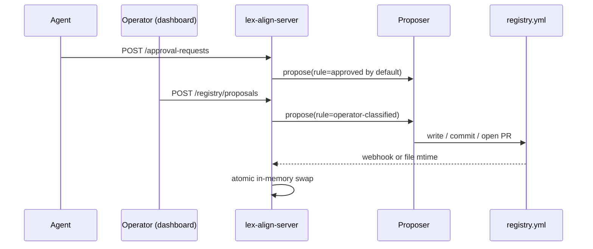

# Approvals (advanced): proposer backends and PR-based review

!!! info "Most installs don't need this page"
    The default flow is **`local_file`** — set `REGISTRY_PATH` to a
    YAML file, run `lex-align-server check-config` to verify the
    install, and you're done. No tokens, no PRs, no webhook.

    This page is the multi-team / org-wide story: an experimental
    GitHub PR proposer for orgs that want every registry change to
    go through review. The PR-based path is included for completeness
    and is **not the recommended default** — large-org adoption may
    promote it later. If you're a single team, the
    [Getting Started](getting-started.md) guide is the path you want.

When an agent calls `lex-align-client request-approval` or an operator
clicks **Add to registry** on the dashboard, lex-align doesn't mutate
the in-memory registry directly. It dispatches a *proposal* to the
configured **proposer backend**, which decides how the change reaches
`registry.yml`. The server hot-reloads when the YAML changes — no
restart, no in-memory drift.

This page explains the four built-in backends, the auto-detection rules
that pick one for you, the merge → reload flow, and the "implicit
candidates" panel on the dashboard.

<!-- TODO: image — overview diagram showing
agent → server → proposer → (github | local-file | local-git | log-only)
→ registry.yml → reload → server -->
*[image placeholder: end-to-end approval flow diagram]*

---

## The four backends

| Backend | When it fits | What "approve" means | Reload trigger |
| --- | --- | --- | --- |
| **`log_only`** | Read-only demos, evaluating lex-align without a policy repo | Logs the proposal; no durable change | n/a |
| **`local_file`** | Single-user mode, small teams without a git host | Writes directly to `registry.yml` (atomic temp + rename, validates first) | File watcher (`REGISTRY_RELOAD_INTERVAL`) |
| **`local_git`** | Teams that want `git log` audit trail without a remote | Same as `local_file` then `git commit` | File watcher |
| **`github`** | Production orgs with PR review culture | Branches, commits, pushes, opens a PR; reviewer merges; webhook reloads | GitHub `pull_request.merged` webhook |

A fifth option — `module:path:Class` — lets an org drop in a custom
`Proposer` (mTLS-backed git host, internal CI portal, etc.). One Python
file, no fork required.

---

## Auto-detection (you usually don't have to set anything)

`REGISTRY_PROPOSER` is optional. The loader picks based on which
*registry write target* you've configured:

```
1. REGISTRY_REPO_URL set explicitly      → github (opt-in only)
2. REGISTRY_PATH inside a git working    → local_git
   tree (auto-detected via `git -C`)
3. REGISTRY_PATH writable                → local_file
4. nothing                               → log_only (with warning)
```

The single-user developer running `lex-align-server init && docker
compose up` gets `local_file` for free — clicking Approve writes the
YAML, the watcher reloads. No GitHub credentials, no PR setup.

!!! note "github is opt-in only"
    Earlier versions auto-promoted a local git tree to the github
    backend if a GitHub remote and `GITHUB_TOKEN` were both present.
    That surprised single-team operators who weren't ready for PR-based
    review. The github backend is now selected only when you set
    `REGISTRY_REPO_URL` yourself.

---

## Two paths to a proposal — one engine



* **Agent path** — `lex-align-client request-approval` returns 202
  immediately; the proposer fires asynchronously. The agent isn't
  blocked on a slow git push, and the audit row is durable even if the
  proposer hits a transient outage. The agent's PR proposes status
  `approved` (a safe default); reviewers can change it to `preferred`
  / `version-constrained` / etc. before merging.
* **Operator path** — the dashboard's **Add to registry…** button
  posts to `/api/v1/registry/proposals` with the operator's chosen
  classification. Same proposer, different default rule.

When both paths fire on the same package, the GitHub backend amends the
existing branch and posts a follow-up comment on the open PR rather
than opening a duplicate.

---

## Merge → reload (no restart)

Once a PR merges:

1. GitHub posts to `POST /api/v1/registry/webhook` with a signed
   payload (HMAC-SHA256 over the body, secret = `REGISTRY_WEBHOOK_SECRET`).
2. The server pulls the merged YAML into `REGISTRY_PATH`.
3. `reload_registry()` recompiles via the same schema validator the
   CLI uses, and **atomically swaps** `app.state.lex.registry`. In-flight
   `/evaluate` calls finish against the old object; the next call sees
   the new rules.
4. Any `PENDING_REVIEW` approval rows for the new packages flip to
   `APPROVED` automatically — the dashboard pending queue auto-trims.
5. Validation failure on reload? Server logs the error, keeps the old
   registry, and surfaces a flag in `/api/v1/health` so an alerting
   pipeline can notice. **The server doesn't blow up because someone
   merged a typo'd YAML.**

Two **belt-and-suspenders** fallbacks make a missed webhook recoverable:

* `POST /api/v1/registry/reload` — operator-only manual trigger.
* A 5-minute background poller (`REGISTRY_RELOAD_INTERVAL`) reloads on
  YAML mtime change. Cheap (one stat per tick) and works for the
  local-file / local-git modes that have no webhook at all.

<!-- TODO: image — screenshot of the PR opened by the bot -->
*[image placeholder: example PR opened by lex-align bot, showing the
package, proposed status, agent identity, and rationale in the body]*

---

## "Why is this pending?" — the implicit-candidates panel

The dashboard's pending queue used to show only packages that an agent
explicitly filed an approval request for. That misses a lot of activity
worth triaging: pre-commit checks, Claude Code edit-time hooks,
provisional verdicts the agent never followed up on.

The panel now has two sections:

| Section | Source | Notable cases caught |
| --- | --- | --- |
| **Pending approval requests** | `approval_requests` table | Agent (or operator) explicitly asked for this. |
| **Implicit candidates** | `audit_log` over the last 30 days, with no matching approval request | Pre-screened, repeatedly denied, provisional with no rationale follow-up. |

Each implicit row carries a **reason badge** so operators can see at a
glance *why* a package is surfacing. The reason takes the highest-signal
classification that applies:

* `provisional-no-rationale` — the package got `PROVISIONALLY_ALLOWED`
  and the agent didn't follow up with `request-approval`. **Highest
  signal**: someone is using it but hasn't filed paperwork.
* `repeatedly-denied` — three or more `DENIED` verdicts in the window.
  Suggests an explicit registry rule (banned, version-pinned, replaced)
  would short-circuit future checks for everyone.
* `pre-screened` — only `check` calls, all benign. Lower signal but
  useful for "things lots of agents poke at." Sometimes a real
  candidate; sometimes just noise.

<!-- TODO: image — screenshot of the dashboard showing both sections,
with the reason badges visible -->
*[image placeholder: dashboard showing the explicit pending panel
above the implicit candidates panel with reason badges]*

Once a package lands in the registry (PR merged → reload, or local
write → file watcher reload), it disappears from both sections.

---

## Configuration reference

| Env var | Used by | Default | Purpose |
| --- | --- | --- | --- |
| `REGISTRY_PROPOSER` | loader | *(auto)* | `log_only` / `local_file` / `local_git` / `github` / `module:Class` |
| `REGISTRY_PATH` | local-file, local-git, reloader | unset | Path to `registry.yml` on disk |
| `REGISTRY_REPO_URL` | github | unset | `https://github.com/owner/repo` or `git@…` |
| `REGISTRY_REPO_TOKEN` | github | unset | PAT or App installation token |
| `REGISTRY_FILE_PATH` | github | `registry.yml` | Path to the YAML inside the repo |
| `REGISTRY_DEFAULT_BRANCH` | github | `main` | Base for the proposal branches |
| `REGISTRY_REPO_WORKDIR` | github | `/var/lib/lexalign/registry-work` | Server-local clone cache |
| `REGISTRY_BOT_AUTHOR_NAME` | local-git, github | `lex-align bot` | Commit author |
| `REGISTRY_BOT_AUTHOR_EMAIL` | local-git, github | `lex-align@localhost` | Commit author email |
| `REGISTRY_WEBHOOK_SECRET` | webhook | unset | HMAC-SHA256 secret for `/api/v1/registry/webhook` |
| `REGISTRY_RELOAD_INTERVAL` | poller | `300` | Seconds between mtime checks; 0 disables |
| `GITHUB_API_BASE` | github | `https://api.github.com` | Override for GitHub Enterprise |

---

## GitHub permissions cheat sheet

The minimum a **fine-grained PAT** (or GitHub App installation) needs,
scoped to the registry repo:

| Permission | Why |
| --- | --- |
| `Contents: Read & Write` | clone, branch, commit, push |
| `Pull requests: Read & Write` | open the PR, post follow-up comments |
| `Metadata: Read` | auto-granted, required for any API call |

For the webhook back to lex-align: a webhook on the repo posting to
`https://your-server/api/v1/registry/webhook` with content type
`application/json`, the same `REGISTRY_WEBHOOK_SECRET`, and these
events:

* `pull_request` (the merge signal)
* `push` (optional belt-and-suspenders for direct edits)

If your default branch requires signed commits, the bot account needs a
GPG key configured. We never auto-merge — the human reviewer is always
in the loop — so required-reviewer protection is fine.

<!-- TODO: image — annotated screenshot of GitHub's webhook config UI -->
*[image placeholder: GitHub webhook configuration screenshot]*
