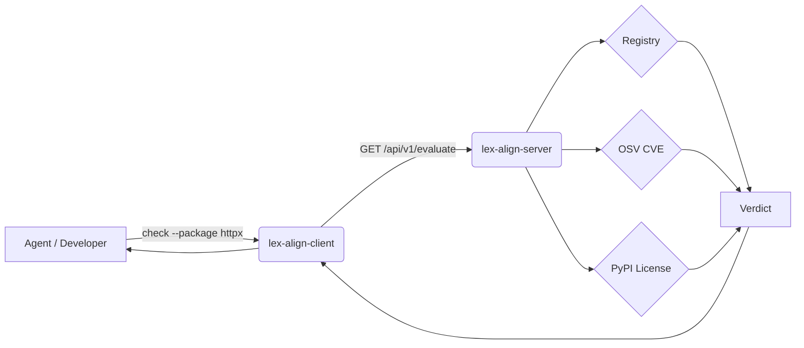

<figure markdown>
  { width="520" }
</figure>

# lex-align

> **Enforce your dependency policy before AI agents or developers can commit
> it. Every package gets checked against your approved registry, OSV CVE
> scores, and license rules — returning a clear verdict so agents can act
> without ambiguity and violations never reach your codebase.**

Your AI coding agent just added three packages to `pyproject.toml`. Are
any of them banned by legal? Carrying a critical CVE? Pulling AGPL into
a product you ship? You don't know — and you won't, until somebody
reviews the diff.

`lex-align` puts a deterministic policy check between every package
addition and your repo, before the bytes are written.

---

## How it works

A central FastAPI server is the source of truth. The client is thin: a
CLI plus two hooks. Every check runs three gates — your internal
registry, OSV CVE scores, and PyPI license metadata — and returns one
of three verdicts.



Two enforcement points cover the common ways a dependency lands in
`pyproject.toml`:

- A git **pre-commit hook**: universal backstop, fires for every agent
  and every human that tries to commit a governed repo.
- A Claude Code **`PreToolUse` hook**: intercepts edits to
  `pyproject.toml` *before* the bytes hit disk, so a `DENIED` package
  never gets written in the first place.

The agent, the human developer, and the pre-commit hook all hit the
same server and get the same answer.

---

## The three verdicts

The verdict surface is small on purpose. AI agents don't reason well
about free-form policy text; they branch reliably on a closed enum.

| Verdict | Meaning | Agent action |
|---|---|---|
| `ALLOWED` | Registered. CVE and license checks passed. | Add the package. |
| `PROVISIONALLY_ALLOWED` | Not in registry, but CVE and license checks passed. | Add the package, then call `request-approval` to enqueue formal review. |
| `DENIED` | One of the gates blocked. The `reason` field says which one; `replacement` may suggest a swap. | Pick something else. |

This is the **"use first, approve in parallel"** pattern. A
sensible-but-unknown package isn't a roadblock — it's a queued review.
The agent uses it now, the human reviews it later, and nobody stalls
on a synchronous approval round-trip.

---

## Agent support

`lex-align`'s primary target is **[Claude Code]**. The pre-commit hook
is the universal backstop for everything else — Cursor, Aider, Codex,
a human at the terminal — but only Claude Code gets the edit-time
intercept and the auto-written `CLAUDE.md`.

| Capability | [Claude Code] | [Cursor] | [Aider] |
|---|:---:|:---:|:---:|
| Git pre-commit guardrail (hard block on `DENIED`) | :material-check-circle: | :material-check-circle: | :material-check-circle: |
| `check` / `request-approval` CLI | :material-check-circle: | :material-check-circle: | :material-check-circle: |
| Edit-time `pyproject.toml` intercept | :material-check-circle: via `PreToolUse` | :material-close-circle: | :material-close-circle: |
| Auto-prompted advisor before adding a dep | :material-check-circle: via `CLAUDE.md` | :material-alert-circle-outline: user-supplied `.cursorrules` | :material-alert-circle-outline: user-supplied `CONVENTIONS.md` |
| Auto-installed by `lex-align-client init` | :material-check-circle: | :material-close-circle: | :material-close-circle: |

Worst case for a non-Claude agent is "denied dep blocked at commit
time" rather than "denied dep slips through". [Full breakdown →](agent-support.md)

[Claude Code]: https://claude.com/claude-code
[Cursor]: https://cursor.com/
[Aider]: https://aider.chat/

---

## How lex-align compares

Most existing tools catch problems *after* a PR is open. `lex-align` is
narrower in scope (Python only) but enforces policy *before* the bytes
hit disk, with a closed-enum verdict that AI agents can branch on.

| Feature                       | Dependabot | Snyk     | FOSSA   | lex-align   |
|-------------------------------|:----------:|:--------:|:-------:|:-----------:|
| CVE checking                  | ✅         | ✅       | ✅      | ✅          |
| License compliance            | ❌         | ✅       | ✅      | ✅          |
| Approved registry enforcement | ❌         | ❌       | ❌      | ✅          |
| Pre-commit interception       | ❌         | ❌       | ❌      | ✅          |
| AI agent integration          | ❌         | ❌       | ❌      | ✅          |
| Language support              | 20+        | 10+      | 20+     | Python only |
| Cost                          | Free       | Freemium | Paid    | Free        |
| Self-hosted                   | ✅         | Partial  | Partial | ✅          |

The bottom three rows are where `lex-align` differs in kind, not just
degree: an approved-registry gate, an edit-time `PreToolUse` intercept,
and an auto-written `CLAUDE.md` so agents pre-flight every dep without
being asked.

---

## Getting started

The shortest path from zero to a working `check`:

```bash
# 1. Server (one-time, on a host you control)
pip install "lex-align[server]"
lex-align-server init && cd lexalign
lex-align-server registry compile registry.yml registry.json
docker compose up -d

# 2. Client (in any project you want governed)
pip install lex-align
cd /path/to/your/project
lex-align-client init
lex-align-client check --package httpx
```

`init` writes `.lexalign.toml`, installs `.git/hooks/pre-commit`, and —
if Claude Code is detected — wires the `PreToolUse` hook into
`.claude/settings.json` and drops a `CLAUDE.md` so every session knows
how to use `check` and `request-approval`.

[Full Getting Started →](getting-started.md) ·
[For Agents →](for-agents.md) ·
[API reference →](api.md)

---

## Project status

Honest about scope. `lex-align` does one thing: dependency policy
enforcement for Python projects, single-user by default.

| Phase | Status |
|---|---|
| **1.** Server core (registry, license, CVE, audit, evaluate) | :material-check-circle: shipped |
| **2.** Thin client (init, check, request-approval, pre-commit, Claude hooks) | :material-check-circle: shipped |
| **3.** Approval workflow UI + reporting endpoints | :material-progress-clock: stubbed |
| **4.** Dashboards, PR-creation workflow, org-mode auth | :material-pause-circle-outline: deferred |

What that means today: the server returns verdicts and persists
`request-approval` submissions, but the reviewer UI, the PR-creation
workflow against the registry repo, and multi-tenant auth are not here
yet. If you need a polished dashboard for legal to triage from, this
isn't that tool — *yet*.

**Scope limits to be explicit about:**

- Python and `pyproject.toml` only. Other package ecosystems are not
  on the roadmap.
- Single-user mode is the default. Org-mode auth is wired as a flag
  but not fully implemented.
- The server only talks to PyPI (license metadata) and OSV (CVE feed).
  The audit log lives on the server's host. Nothing is sent to a third
  party.
