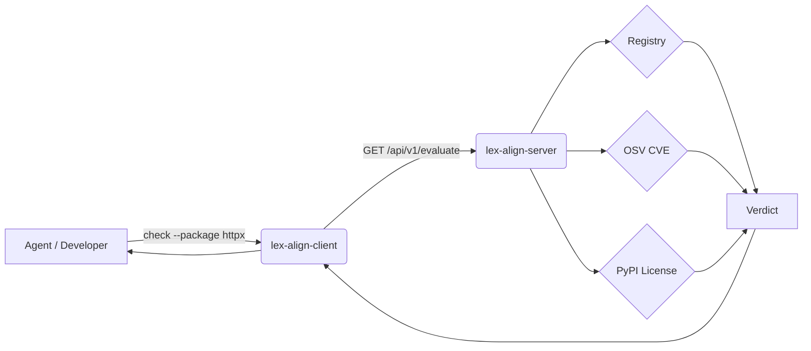

<figure markdown>
  { width="520" }
</figure>

# lex-align

> **Enforce your dependency policy before AI agents or developers can commit
> it. Every package gets checked against your approved registry, OSV CVE
> scores, and license rules — returning a clear verdict so agents can act
> without ambiguity and violations never reach your codebase.**

Your AI coding agent just added three packages to `pyproject.toml`. Are
any of them banned by legal? Carrying a critical CVE? Pulling AGPL into
a product you ship? You don't know — and you won't, until somebody
reviews the diff.

`lex-align` puts a deterministic policy check between every package
addition and your repo, before the bytes are written.

---

## How it works

A central FastAPI server is the source of truth. The client is thin: a
CLI plus a handful of hooks. Every check runs three gates — your
internal registry, OSV CVE scores, and PyPI license metadata — and
returns one of three verdicts.

Two enforcement points cover the common ways a dependency lands in
`pyproject.toml`:

- A git **pre-commit hook**: universal backstop, fires for every agent
  and every human that tries to commit a governed repo.
- A Claude Code **`PreToolUse` hook**: intercepts edits to
  `pyproject.toml` *before* the bytes hit disk, so a `DENIED` package
  never gets written in the first place.

The agent, the human developer, and the pre-commit hook all hit the
same server and get the same answer.

---

[Getting Started →](getting-started.md) ·
[For Agents →](for-agents.md) ·
[API Reference →](api.md) ·
[Project Status & Comparison →](roadmap.md)
