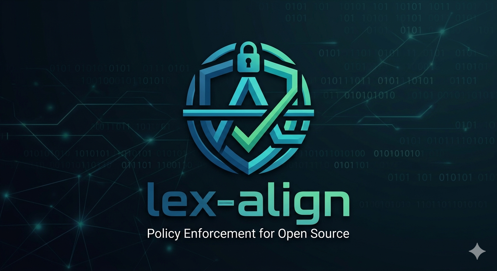
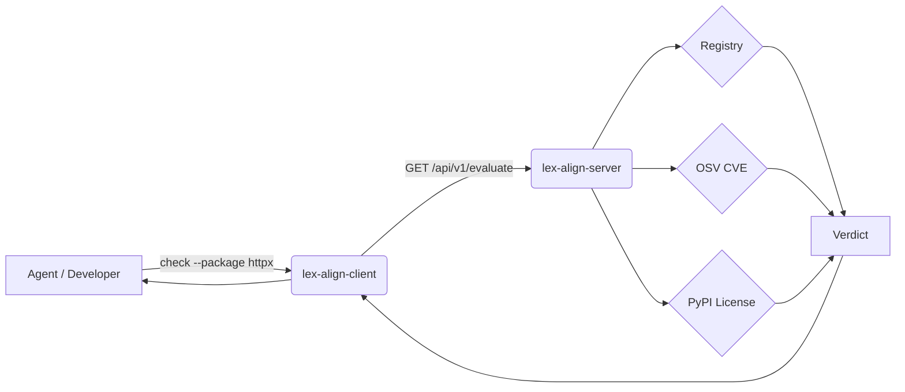

<figure markdown>
  { width="520" }
</figure>

> **Enterprise governance platform that ensures all code generated by AI
> agents or developers is legally compliant, architecturally sound, and
> secure.**

`lex-align` moves governance from a reactive process to a proactive,
collaborative planning tool. Policy enforcement is centralized so
compliance issues are caught **before** code is committed, security and
legal teams get clear intelligence into what AI agents are pulling into
projects, and developers (and agents) are steered toward a "golden path"
of safe dependencies.

---

## Why lex-align

-   :material-shield-check: __Centralized policy, decentralized usage__

    ---

    A single FastAPI server is the source of truth for the package
    registry, OSV CVE feed, and license policy. Every client — human or
    AI — gets the same verdict.

-   :material-robot-happy: __Built for AI agents__

    ---

    Verdicts are returned in a small, deterministic vocabulary
    (`ALLOWED`, `PROVISIONALLY_ALLOWED`, `DENIED`) so an agent can act
    without ambiguity, and the Claude Code `PreToolUse` hook intercepts
    `pyproject.toml` edits before bytes hit disk.

-   :material-lightning-bolt: __"Use first, approve in parallel"__

    ---

    A package that passes registry, CVE, and license checks is
    provisionally allowed for immediate use. The agent commits and
    keeps moving while `request-approval` enqueues formal review
    asynchronously.

---

## At a glance

[IMAGE: FEATURE_DEMO]

A typical evaluation flow:

The verdict surface is small on purpose:

| Verdict | Meaning |
|---|---|
| `ALLOWED` | All checks passed; package is fully sanctioned. |
| `PROVISIONALLY_ALLOWED` | Unknown to registry but license + CVE passed. Eligible for `request-approval`. |
| `DENIED` | One of the checks blocked. The `reason` field explains which. |

---

## Agent support

Primary target is **[Claude Code]** — `lex-align-client init` wires up
both the pre-commit hook and the `PreToolUse` edit-time intercept
automatically, and writes a `CLAUDE.md` so every session knows how to
use `check` / `request-approval`. The hard guardrail (the pre-commit
hook) is universal, so other agents are still backstopped at commit
time.

| Capability | [Claude Code] | [Cursor] | [Aider] |
|---|:---:|:---:|:---:|
| Git pre-commit guardrail | :material-check-circle: | :material-check-circle: | :material-check-circle: |
| `check` / `request-approval` CLI | :material-check-circle: | :material-check-circle: | :material-check-circle: |
| Edit-time `pyproject.toml` intercept | :material-check-circle: | :material-close-circle: | :material-close-circle: |
| Auto-prompted plan-time advisor | :material-check-circle: | :material-alert-circle-outline: | :material-alert-circle-outline: |
| Auto-installed by `lex-align-client init` | :material-check-circle: | :material-close-circle: | :material-close-circle: |

[Full breakdown →](agent-support.md)

[Claude Code]: https://claude.com/claude-code
[Cursor]: https://cursor.com/
[Aider]: https://aider.chat/

---

## How risk is scored

The CVE gate is a single configurable threshold over the OSV CVSS score,
expressed as a fraction of 10. With \( T \) the configured threshold
and \( s \) the highest CVSS score reported for a package version,

\[
\text{deny}(s) \;=\; \mathbb{1}\!\left[\, s \;\ge\; 10 \cdot T \,\right]
\]

so the default `cve_threshold = 0.9` denies anything with a CVSS of
**9.0 or higher** (i.e. critical), even if the package is registry-
`preferred`. Inline math also works: a denial fires whenever
\( s \ge 10T \).

---

## Quick links

- [Getting Started](getting-started.md) — install the client, run the server, init a project.
- [Agent Support](agent-support.md) — which features work for which agents (Claude Code / Cursor / Aider).
- [For Agents](for-agents.md) — concise, machine-friendly playbook for AI coding agents.
- [`llms.txt`](llms.txt) — site index following the [llmstxt.org](https://llmstxt.org) convention.
- [API Reference](api.md) — auto-generated docstrings for `lex_align_client` and `lex_align_server`.
- [Source on GitHub](https://github.com/dlfelps/lex-align)

---

## Project status

| Phase | Status |
|---|---|
| **1.** Server core (registry, license, CVE, audit, evaluate) | :material-check-circle: |
| **2.** Thin client (init, check, request-approval, pre-commit, Claude hooks) | :material-check-circle: |
| **3.** Approval workflow + report endpoints | :material-check-circle: stubbed |
| **4.** Dashboards, PR-creation workflow, org-mode auth | :material-progress-clock: deferred |
